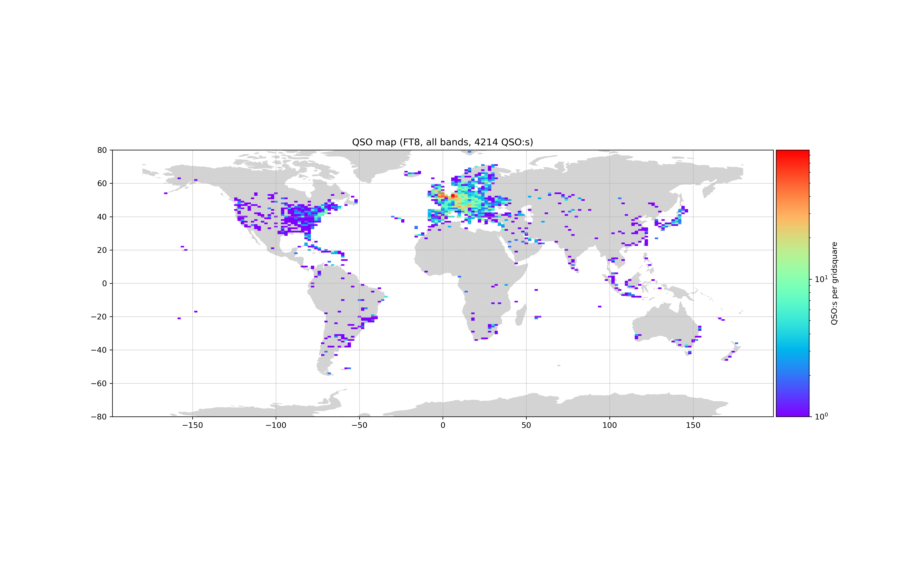
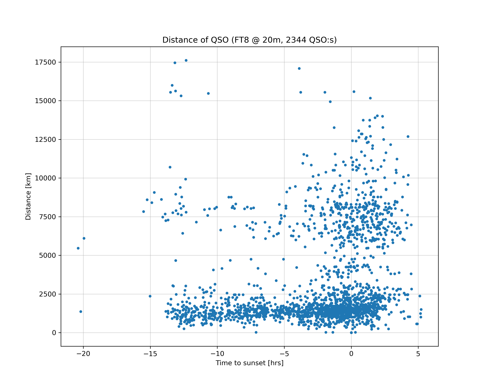
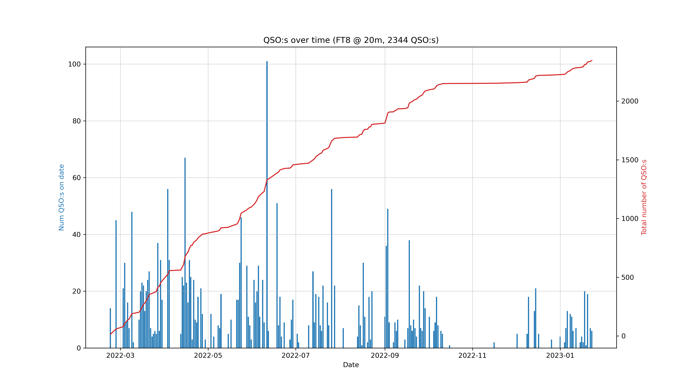

# Extraction of maps and statistics from ADIF log files

The enclosed Python program `adifstats.py` extracts statistical information
from an ADIF (Amateur Data Interchange Format 1.0) log file, as commonly used
in the Amateur Radio community.

The statistics which so far can be extracted are as follows:

  1. Summarize the contents of the supplied ADIF file in plain text to standard
     output. (`summarize(adif_filename, summary_filename=None)`)

  2. Generation of standard Python dictionaries for the compilation of QSO:s
     found in the ADIF file (`qsodict(adif_filename)`).

  3. Summary of geographic QSO densities (`qsodensity(qsos, buckets, txmode,
     freqband)`):
        a. Per Maidenhead grid square.
        b. Per country.

  4. Generation of a world map with QSO density coloring for each Maidenhead
     grid square. (`qsomap(qsos, txmode, freqband, sizes, colors)`)

  5. Generation of graphs of distance vs received power (`qsograph(qsos,
     graphmode, txmode, freqband)`).

  6. Generation of histograms of QSO frequencies, distances, grids and
     countries (`qsohistogram(qsos, txmode, freqband)`,
     `distancehistogram(qsos, txmode, freqband)`,
     `gridhistogram(qsos, txmode, freqband)` and
     `countryhistogram(qsos, txmode="FT8", freqband="all", numCountries=30)`),
     in two modes:

        a. Histogram of number of qso:s country-wise:
           Sorts the dictionary of worked countries in descending order
           ands keep the highest numCountries ones. When creating the
           sorted dictionary, we rely on that dictionaries preserve
           insertion order since Python 3.7+.

        b. Histogram of accumulated worked distance country-wise:
           Sorts the dictionary of accumulated distances in descending
           order and keeps the highest numCountries ones. Again, when
           creating the sorted dictionary, we rely on that dictionaries
           preserve insertion order since Python 3.7+.

For specifications of the ADIF file format, see https://www.adif.org/100/adif_10
0.htm

The `adifstats.py` program makes use of the following packages:
   * pyhamtools       https://github.com/dh1tw/pyhamtools 
   * adif_io-0.0.3    https://pypi.org/project/adif-io/
   * geopandas  https://geopandas.org/en/stable/gallery/plotting_with_geoplot.html
   * geoplot    https://residentmario.github.io/geoplot/index.html

See also https://github.com/tylert/maidenhead

## Examples

### QSO density map, per Maidenhead grid square

QSO map showing the number of QSO:s per grid square (here with mode=FT8,
bands=all).

### Histogram of accumulated distances, country-wise

Graph showing the histogram of accumulated distances, country-wise, (here
with mode=FT8, bands=all).

### Distance for QSO:s vs time to sunset

Graph of distance for QSO:s versus time to sunset, for FT8 and the 20 metre
band.

### Difference between sent and received signal strength QSO:s vs time to sunset

Graph of the difference between sent and received signal strength for QSO:s
versus time to sunset, for FT8 and the 40 metre band. Here "sent signal
strength" is the signal strength as reported by the remote recipient, as
delivered in his/her signal report.

### Histogram and accumulated number of QSO:s over time

Graph showing the histogram and accumulated number of QSO:s over time.
QSO map showing the number of QSO:s per grid square (here with mode=FT8,
bands=20m).

## Copyright
Copyright (C) 2024, Fredrik Jonsson, under GPLv3. See enclosed LICENSE.

## Location of master source code
The source and documentation can be found at https://github.com/hp35/adifstats
